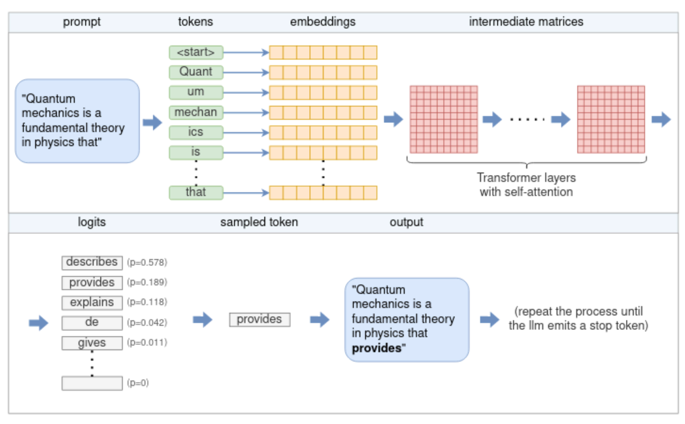
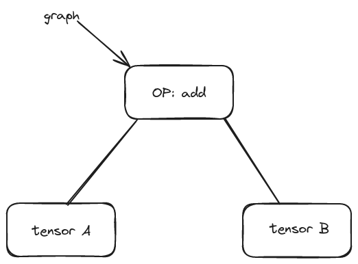
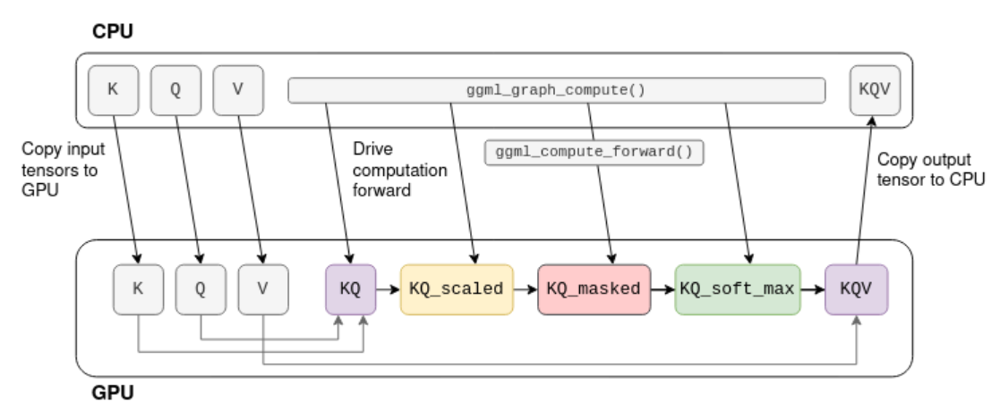
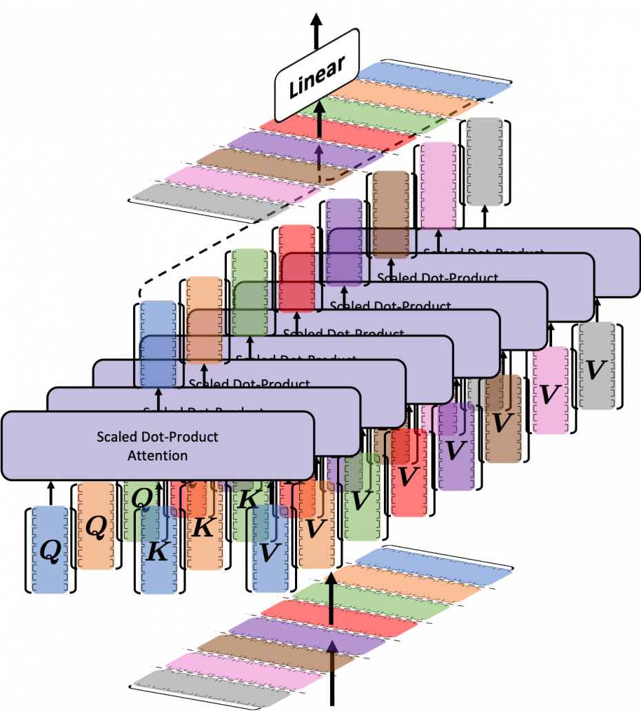
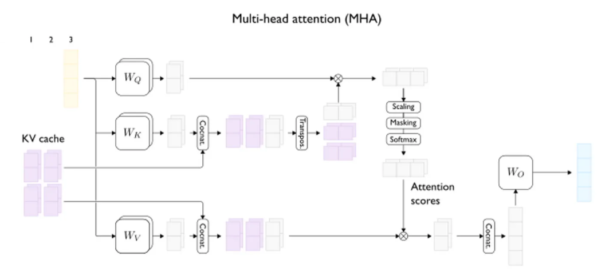

# Introduction to **llama.cpp**

Wayne Feng
June 2024

---

## Agenda

- Usage
- Implementation

---

<!-- _class: lead -->
## Usage

---

## Run with ollama

Install ``ollama``

```bash
curl -fsSL https://ollama.com/install.sh | sh
```

Run ``llama3``

```bash
# ollama pull llama3:8b
ollama run llama3:8b
```

Combine with ``vscode`` and plugin [``continue``](continue.dev).

---

## Compile source code

Based on commit [504f0c34](https://github.com/ggerganov/llama.cpp/tree/504f0c34)

```bash
git clone https://github.com/ggerganov/llama.cpp.git
cd llama.cpp
make -j$(nproc) #LLAMA_CUDA=1
```

For Intel devices with SYCL enabled.

```bash
source /opt/intel/oneapi/setvars.sh
# Option 1: Use FP32 (recommended for better performance in most cases)
cmake -B build -DLLAMA_SYCL=ON -DCMAKE_C_COMPILER=icx -DCMAKE_CXX_COMPILER=icpx
# Option 2: Use FP16
cmake -B build -DLLAMA_SYCL=ON -DCMAKE_C_COMPILER=icx -DCMAKE_CXX_COMPILER=icpx -DLLAMA_SYCL_F16=ON
cmake --build build --config Release
```

---

## Converting and quantizing GGUF manually

Converting models to GGUF

```bash
python3 -m venv .env
pip install -r requirements/requirements-convert-hf-to-gguf.txt
python convert-hf-to-gguf.py  ~/checkpoints/Llama-2-7b-chat-hf
```

Quantizing GGUF model

```bash
./build/bin/quantize ~/checkpoints/Llama-2-7b-chat-hf/ggml-model-f16.gguf Q4_K
```

---

## Quantization

*q4_k* quantization is better than *q4_0*, where k means [k-means clustering](https://en.wikipedia.org/wiki/K-means_clustering)


<!-- quantize with
  q4_0 calculates max value of a chunk;
  q4_1 calculates max and min value of a chunk;
  q4_k calculates k-means clusters of the chunk.
  Since k-means clustering generates less MSE (mean squired error),
  the result is more accurate with qn_k.
  
  qn_k_s and qn_k_m should be same.
  -->

<!-- quantization is done by chunk, how is the chunkes deviced?
```C++
llama_model_quantize_internal()
    llama_tensor_quantize_internal()
        n_per_row = tensor->ne[0];
        n_row = tensor->ne[1];
        ggml_quantize_chunk(n_row, n_per_row);
```
 -->

---

## Run llama.cpp manually

Run the model with CPU.

```bash
./build/bin/main --color \
 -m ~/checkpoints/Llama-2-7b-chat-hf/ggml-model-Q4_K.gguf \
 -p "What is openvino"
```

With GPU.

```bash
./build/bin/main --color \
 -m ~/checkpoints/Llama-2-7b-chat-hf/ggml-model-Q4_K.gguf \
 -p "What is openvino" -ngl 9999
```

---

## Bonus: [llamafile](https://github.com/Mozilla-Ocho/llamafile.git)

- Based on `llama.cpp`
- Compile once, run everywhere with [Actual Portable Executable](https://justine.lol/ape.html).

---

## Some background information

- model formats
- tokenizers
- transformers
- sampling

- decoder-only models V.S. encoder-decoder models

---

### Model Formats

- pickle (pytorch)
- h5 (tensorflow)
- protobuf (onnx)
- safetensors
- GGUF
- ...

---

<!-- _class: lead -->
### GGUF details


---

<!-- _class: lead -->
### Transformers


---

<!-- _class: lead -->
### LLM Inferencing



---

### Tokenizers

- BPE: Byte Pair Encoding [Sennrich et al.](https://www.aclweb.org/anthology/P16-1162)
- WPM: [Word Piece](https://arxiv.org/pdf/1609.08144.pdf)
- SPM: Sentence Piece

<!--
```C++
struct llama_vocab {};
struct llm_tokenizer_bpe {};
struct llm_tokenizer_spm {};
struct llm_tokenizer_wpm {};
```
 -->

---

### Sampling

Choosing the next predicted token.

- Greedy sampling
- Temperature sampling
- Grammar
- ...

---

<!-- _class: lead -->
## Implementation

---

### Inferencing process

```C++
main() {
    ...
    llama_backend_init();
    std::tie(model, ctx) = llama_init_from_gpt_params(params);
    inp = ::llama_tokenize(ctx, params.prompt, true, true);
    while (...) {
        llama_decode(ctx, llama_batch_get_one(...));
        token = llama_sampling_sample(...);
        output_ss << llama_token_to_piece(ctx, token);
    }
    llama_free(ctx);
    ...
}
```

---

### Decode process

```C++
llama_decode() {
    ...
    if (!llama_kv_cache_find_slot(kv_self, u_batch)) {
        return 1;
    }
    ggml_backend_sched_reset(lctx.sched);
    ggml_backend_sched_set_eval_callback(...);
    ggml_cgraph * gf = llama_build_graph(lctx, u_batch, false);
    ggml_backend_sched_alloc_graph(lctx.sched, gf);
    llama_set_inputs(lctx, u_batch);
    llama_graph_compute(lctx, gf, n_threads);
    ggml_backend_tensor_get_async(...);
    ...
}
```

---

### Graph Compute

Compute graphs are composed with `ggml_tensor`
A graph with only `ggml_add` looks like:

<!--
 nodes vs leafs
 -->
---

<!-- _class: lead -->
### GPU backend



---

### Memory management

- tensor allocator `ggml_tallocr`
- graph allocator `ggml_gallocr`
  - dynamic allocator `ggml_dyn_tallocr`
  - hash set `ggml_hash_set`
  - node allocator `node_alloc`
  - leaf allocator `leaf_alloc`
- backend allocator impl `ggml_backend_buffer_t`

---

### KV cache



---

### KV cache


<!--
- **Stores pre-computed token representations**: The cache stores key-value pairs where the key is a token and the value is its vector representation. This avoids redundant calculations for already encountered tokens.
- **Targeted Storage**: The cache prioritizes storing frequently used tokens or those with complex representations.
- **Eviction Strategies**: The cache evicts less important entries (LRU, LFU, or hybrid approaches) to make space for new ones.
- **Fragmentation Mitigation**: Techniques like compaction or pre-allocation help maintain efficient cache space utilization.
-->

<!--
---

## Tricks

- Lookup tables of fp16->fp32, exp() and activation functions: GELU, QuickGELU, and SiLU.

---

## Inferencing customized modes

Executing llava requires CLIP. Refer to `examples/llava/clip.cpp`.
-->

---

<!-- _class: lead -->
## Q&A
