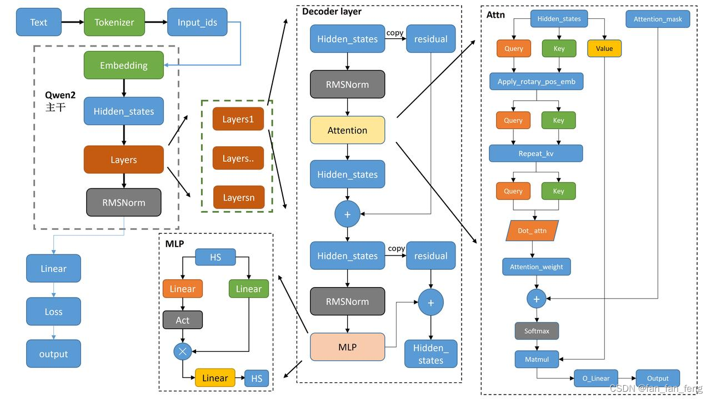
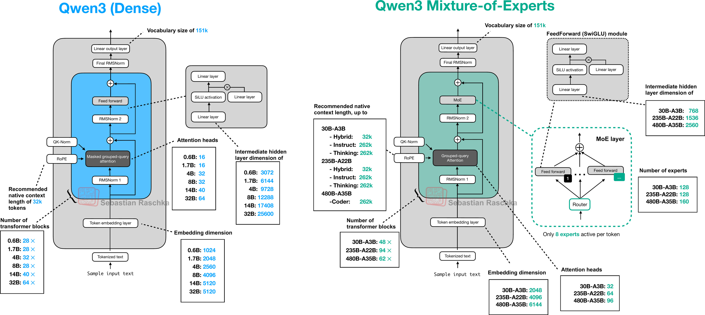

#+TITLE:     Roofline Model for LLM Scaling
#+HTML_HEAD: <link rel="stylesheet" type="text/css" href="css/article.css" />
#+HTML_HEAD: <link rel="stylesheet" type="text/css" href="css/toc.css" />
#+HTML_HEAD: 
#+OPTIONS:   tex:t
#+INDEX: deeplearning!llm
#+INDEX: deeplearning!attention
#+INDEX: deeplearning!transformer
#+INDEX: deeplearning!roofline

* What is roofline model

Definition from Wikipedia:

#+begin_quote
The Roofline Model is a powerful, visual performance analysis tool that plots
an algorithm's performance (FLOPs/s) against its Arithmetic Intensity (FLOPs/byte)
on a log-log graph, revealing if it's limited by computation (compute-bound) or
memory (memory-bound) by showing hardware "roofs" (peak FLOPs/s & peak bandwidth)
and identifying optimization opportunities. It helps developers understand bottlenecks,
compare code against hardware limits, and guide optimizations like increasing
intensity or improving data locality. 
#+end_quote

- Work :: the work /W/ denotes the number of operations (FLOPs) by given kernel.
- Memory Traffic :: the memory traffic /Q/ denotes the number of bytes of memory transfer
  inccured during the execution of the kernel.
- Arithmetic Intensity :: also refered as /operational intensity/, is the ration of
  the work /W/ to the memory traffic /Q/.
\begin{equation}
I = \frac{W}{Q}
\end{equation}

With $\pi$ as peak performance and $\beta$ as peak bandwidth, the roofline is
\begin{equation}
P = min
  \begin{cases}
    \pi \\
    \beta \times I
  \end{cases}
\end{equation}
    
#+attr_html: :width 60%
#+attr_html: :align center
[[./img/native_roofline_model.svg]]

* Tools

** Datasheet

** clpeak

** torchprofile

To verify FLOPs and MACs(multiply-accumulate operation) with =torchprofile= library

#+begin_src python
  from torchprofile import profile_macs
  macs = profile_macs(model, sample_data)
  print(macs)
#+end_src

* Basic Operations

** Dot Product

For vector $X \in \mathbb{R}^n$ and $Y \in \mathbb{R}^n$,
\begin{equation}
p = X \cdot{} Y = \sum_{i=0}^{n-1}{x_i y_i}
\end{equation}

When vector length $n \gg 1$,
\begin{equation}
\mathrm{FLOPs} \approx 2 n
\end{equation}

** Softmax

The naive softmax for vector $X \in \mathbb{R}^n$,
\begin{equation}
\sigma(x_i) = \frac{e^{x_i}}{\sum_{j=0}^{n-1}{e^{x_j}}} \ \ \ for \ i = 0, 1, 2, ..., n
\end{equation}

When vector length $n \gg 1$,
\begin{equation}
\mathrm{FLOPs} \approx 3 n
\end{equation}

The naive softmax suffer from numerical instability when $x_i$ are very large or very small.
The softmax with numerical stability,
\begin{equation}
\sigma(x_i) = \frac{e^{x_i - max(\bar{x})}}{\sum_{j=0}^{n-1}{e^{x_j - max(\bar{x})}}}
\end{equation}

When vector length $n \gg 1$,
\begin{equation}
\mathrm{FLOPs} \approx 5 n
\end{equation}

** Attention

\begin{equation}
\mathrm{attn} = \mathrm{softmax}(\frac{Q\cdot{}K^T}{\sqrt{d}})\cdot{}V
\end{equation}

For inputs of shape $(batch, heads, seq\_len, head\_dim)$, FLOPs of softmax is normally ignored.

First calculate $Q\cdot{}K^T$ as
#+begin_src python
  attn_weight = query @ key.transpose(-2, -1) * scale_factor
#+end_src

It takes $2 * batch * heads * seq\_len * seq\_len * head\_dim + 2 * batch * heads * head\_dim * head\_dim$ FLOPs.

THen calculate $softmax(attn)$ and do dropout.
#+begin_src python
  attn_weight = torch.softmax(attn_weight, dim=-1)
  attn_weight = torch.dropout(attn_weight, dropout_p, train=False)
#+end_src

At last calculate attention score
#+begin_src python
  attn = attn_weight @ value
#+end_src

It takes $2 * batch * heads * seq\_len * seq\_len * head\_dim$ FLOPs.

When sequence length is much larger, the FLOPs of attention is

\begin{equation}
\mathrm{FLOPs} \approx 4 * \mathrm{batch} * \mathrm{heads} * \mathrm{seq\_len} * \mathrm{seq\_len} * \mathrm{head\_dim}
\end{equation}

** Grouped-Query Attention

\begin{equation}
N_{kv\_groups} = \lfloor \frac{N_{attn\_heads}}{N_{kv\_heads}} \rfloor
\end{equation}

\begin{equation}
N_{kv\_size} = \frac{N_{attn\_size}}{N_{kv\_groups}}
\end{equation}

#+CAPTION: Grouped-Query Attention
#+fig: 3
[[./img/gqa.png]]

** Sliding Attention

** Fully Connected (Dense) Layer

For fully connected layer of $n_{in}$ inputs and $n_{out}$ outputs,
\begin{equation}
\mathrm{FLOPs} \approx 2 n_{in} n_{out}
\end{equation}

** RMSNorm

Given input vector $x \in \mathbb{R}^m$,
\begin{equation}
a_i = \sum_{j=1}^m{w_ij}{x_j}, \;\; y_i = f(a_i + b_i)
\end{equation}

To use LayerNorm, with $\mu = \frac{1}{n}\sum_{i=1}^n{a_i}$ and $\sigma = \sqrt{\frac{1}{n}\sum_{i=1}^n{(a_i-\mu)^2}}$,
\begin{equation}
\overline{a_i} = \frac{a_i - \mu}{\sigma}g_i, \;\; y_i = f(\overline{a_i} + b_i)
\end{equation}

RMSNorm,
\begin{equation}
\overline{a_i} = \frac{a_i}{RMS(a_i)}g_i, \;\;\; where \; RMS(a) = \sqrt{\frac{1}{n}\sum_{i=1}^{n}{a_i^2}}
\end{equation}

Gain parameter $g \in \mathbb{R}^n$ is used to re-scale the standardized summed inputs, and is set to $1$ at the beginning.

FLOPS of vector of length $n$ include
 1) square of each element $n$,
 2) sum squares $n-1$,
 3) multiply each element by reciprocal $n$,
 4) multiply by weights $n$,

In total is
\begin{equation}
\mathrm{FLOPs} \approx 4n
\end{equation}

Refer to RMSNorm (Root Mean Square Normalization) [[https://arxiv.org/pdf/1910.07467][paper]].

** RoPE

This [[https://www.youtube.com/watch?v=o29P0Kpobz0][video]] explains Rotary Position Embedding (RoPE).

\begin{equation}
f_{\{q,k\}}(x_m,m) = R^d_{\Theta,m}W_{\{q,k\}}x_m
\end{equation}

\begin{equation}
R^d_{\Theta,m} = \begin{pmatrix}
\cos(m\theta_1) & -\sin(m\theta_1) & 0 & 0 & \ldots & 0 & 0 \\
\sin(m\theta_1) & \cos(m\theta_1) & 0 & 0 & \ldots & 0 & 0 \\
0 & 0 & \cos(m\theta_2) & -\sin(m\theta_2) & \ldots & 0 & 0 \\
0 & 0 & \sin(m\theta_2) & \cos(m\theta_2) & \ldots & 0 & 0 \\
\vdots & \vdots & \vdots & \vdots & \ddots & \vdots & \vdots \\
0 & 0 & 0 & 0 & \ldots & \cos(m\theta_{d/2}) & -\sin(m\theta_{d/2}) \\
0 & 0 & 0 & 0 & \ldots & \sin(m\theta_{d/2}) & \cos(m\theta_{d/2}) \\
\end{pmatrix}
\end{equation}

** Convolution

* Models

** Transformers basic

#+begin_export html

---
config:
    look: handDrawn
    theme: neutral
    title: "Transformer Block Architecture"
---
flowchart TD
    input([input]) --[batch,tokens,hidden_size]--> attn_norm
    attn_norm --> q_proj & k_proj & v_proj
    q_proj["<b>q_proj</b>
hidden_size, num_attn_heads*head_dim"] --[batch,num_attn_heads,tokens,head_dim]--> qk_matmul
    k_proj["<b>k_proj</b>
hidden_size, num_kv_heads*head_dim"] --[batch,num_kv_heads,tokens,head_dim]--> qk_matmul
    qk_matmul["<strong>qk_matmul</strong>"] --[batch,num_attn_heads,tokens,tokens]--> softmax
    softmax --> sv_matmul
    v_proj["<b>v_proj</b>
hidden_size, num_kv_heads*head_dim"] --[batch,num_kv_heads,tokens,head_dim]--> sv_matmul
    sv_matmul["<strong>sv_matmul</strong>"] --[batch,num_kv_heads,tokens,head_dim]--> o_proj
    o_proj["<b>o_proj</b>
num_attn_heads*head_dim, hidden_size"] --[batch,tokens,hidden_size]--> attn_add
    input --[batch,tokens,hidden_size]--> attn_add
    attn_add --> mlp_norm --> up_proj
    mlp_norm --> gate_proj --> mlp_act
    gate_proj["<b>gate_proj</b>
hidden_size, intermediate_size"]
    up_proj["<b>up_proj</b>
hidden_size, intermediate_size"] --> mlp_matmul
    mlp_act --> mlp_matmul --[batch,tokens,intermediate_size]--> down_proj
    down_proj["<strong>down_proj</strong>
intermediate_size, hidden_size"] --[batch,tokens,hidden_size]--> mlp_add
    attn_add --> mlp_add
    mlp_add --> output([output])

#+end_export

To calculate the minimum time that a specific device needed to inference a given model.

There're two key factors of LLM: time of first token and average time of rest tokens.

** MoE model (Qwen3 MoE)

#+begin_export html

---
config:
    look: handDrawn
    theme: neutral
    title: "Transformer Block Architecture"
---
flowchart TD
    input([input]) --[batch,tokens,hidden_size]--> attn_norm
    attn_norm --> q_proj & k_proj & v_proj
    q_proj["<b>q_proj</b>
hidden_size, num_attn_heads*head_dim"] --[batch,num_attn_heads,tokens,head_dim]--> qk_matmul
    k_proj["<b>k_proj</b>
hidden_size, num_kv_heads*head_dim"] --[batch,num_kv_heads,tokens,head_dim]--> qk_matmul
    qk_matmul["<strong>qk_matmul</strong>"] --[batch,num_attn_heads,tokens,tokens]--> softmax
    softmax --> sv_matmul
    v_proj["<b>v_proj</b>
hidden_size, num_kv_heads*head_dim"] --[batch,num_kv_heads,tokens,head_dim]--> sv_matmul
    sv_matmul["<strong>sv_matmul</strong>"] --[batch,num_kv_heads,tokens,head_dim]--> o_proj
    o_proj["<b>o_proj</b>
num_attn_heads*head_dim, hidden_size"] --[batch,tokens,hidden_size]--> attn_add
    input --[batch,tokens,hidden_size]--> attn_add --> post_attn_norm -->
    gate["<strong>gate</strong>
-1,hidden_size,#experts"] --> filter_experts --> mlp_norm
    subgraph MLP ["MoEs"]
        mlp_norm --> gate_proj --> mlp_act --> mlp_matmul
        mlp_norm --> up_proj --> mlp_matmul
        gate_proj["<b>gate_proj</b>
hidden_size, intermediate_size"]
        up_proj["<b>up_proj</b>
hidden_size, intermediate_size"]
        mlp_matmul["<strong>mlp_matmul</strong>"] --[batch,tokens,intermediate_size]--> down_proj
        down_proj["<strong>down_proj</strong>
intermediate_size, hidden_size"]
    end
    down_proj --[batch,tokens,hidden_size]--> mlp_add
    attn_add --> mlp_add
    mlp_add --> output([output])

#+end_export

** Vision Transformers (Qwen3 VL)

#+begin_export html

---
config:
    look: handDrawn
    theme: neutral
    title: "Qwen3VL Vision Block"
---
flowchart TD
    input([input]) --[batch,tokens,merge_sz,patch_sz,patch_sz]--> patch_proj
    patch_proj["<strong>patch_embed</strong>
Conv3D"] --[batch,tokens,hidden_sz]--> patch_add[+]
    pos_embed --> patch_add
    patch_add --> hs([hidden_states])
    hs([hidden_states]) --> attn_norm[norm]
    attn_norm --> qkv["<strong>qkv</strong>
dim, dim*3"]
    qkv --> q([q]) --[q:batch, tokens, hidden_sz]--> qk_matmul
    qkv --> k([k]) --[k:batch, tokens, hidden_sz]--> qk_matmul
    qk_matmul["<strong>qk_matmul</strong>"] --[batch,tokens,tokens]--> softmax
    softmax --> sv_matmul
    qkv --> v([v]) --[v:batch, tokens, hidden_sz]--> sv_matmul
    sv_matmul["<strong>sv_matmul</strong>"]  --> o_proj["<b>o_proj</b>
hidden_sz, hidden_sz"] --> attn_add
    attn_out["<strong>attention_out</strong>
batch, tokens, hidden_sz"]
    hs --> attn_add[+] --> attn_out --> mlp_norm[mlp_norm]
    mlp_norm --> linear1["<strong>mlp_fc1</strong>
hidden_sz, intermediate_sz"]
    linear1 --> mlp_act[act] --> linear2["<strong>mlp_fc2</strong>
intermediate_sz, hidden_sz"]
    linear2 --> mlp_add --> ll{has more layer?}
    attn_out --> mlp_add[+]
    ll -- yes --> hs
    ll -- no --> merger_norm[norm]
    merger_norm --> merger_fc1["<strong>merger_fc1</strong>
hidden_sz, hidden_sz"]
    merger_fc1 --> merger_act[act] --> merger_fc2["<strong>merger_fc2</strong>
hidden_sz, out_hidden_sz"]
    merger_fc2 --> output([output])

#+end_export

** LLaMA

Parameters

#+NAME: LLaMA 3.1 model configuration
|                   | llama 3.1 8B | llama 3.1 70B | llama 3.1 405B |
|-------------------+--------------+---------------+----------------|
| layers            |           32 |            80 |            126 |
| hidden size       |         4096 |          8192 |          16384 |
| intermediate size |        14336 |         28672 |          53248 |
| attn heads        |           32 |            64 |            128 |
| k/v heads         |            8 |             8 |              8 |
| vocab size        |       128256 |        128256 |         128256 |

** Qwen2.5

#+CAPTION: Qwen2.5 Architecture
#+NAME: fig:1

#+NAME: Qwen 2.5 model configuration
|                   | Qwen2.5 0.5B | Qwen2.5 7B | Qwen2.5 30B | Qwen2.5 72B |
|-------------------+--------------+------------+-------------+-------------|
| layers            |           24 |         28 |          64 |          80 |
| hidden size       |          896 |       3584 |        5120 |        8192 |
| intermediate size |         4864 |      18944 |       27648 |       29568 |
| attn heads        |           14 |         28 |          40 |          64 |
| k/v heads         |            2 |          4 |           8 |           8 |
| vocab size        |       151936 |     152064 |      152064 |      152064 |

** Qwen3

#+CAPTION: Qwen3 Architecture
#+NAME: fig:2
#+ATTR_HTML: :align center
#+ATTR_HTML: :width 100%

** Qwen3-VL

*** Image preprocessing

With $factor = patch\_size * spatial\_merge\_size$,

- $new\_width = round(image\_width / factor) * factor$
- $new\_height = round(image\_height / factor) * factor$
- $tokens = (new\_width / patch\_size) * (new\_height / patch\_size)$

For Qwen3-VL-4B, patch size is 16 and spatial merge size is 2. A image of size (800, 600) will be resized to
$round(800 / 32) * 32, round(600 / 32) * 32$, which is (800, 608), and the tokens is $(800/16) * (608/16)$,
which is 1900.

* References

- [[https://jax-ml.github.io/scaling-book/gpus/#rooflines-for-llm-scaling-on-gpus][How to scale your models]]
- [[https://medium.com/@dzmitrybahdanau/the-flops-calculus-of-language-model-training-3b19c1f025e4][The FLOPs calculus]]
- [[https://medium.com/@pashashaik/a-guide-to-hand-calculating-flops-and-macs-fa5221ce5ccc][Calculating FLOPs]]
- [[https://arxiv.org/pdf/2402.16363][Roofline Model Insight]]
- [[https://en.wikipedia.org/wiki/Roofline_model][Roofline Model]]
